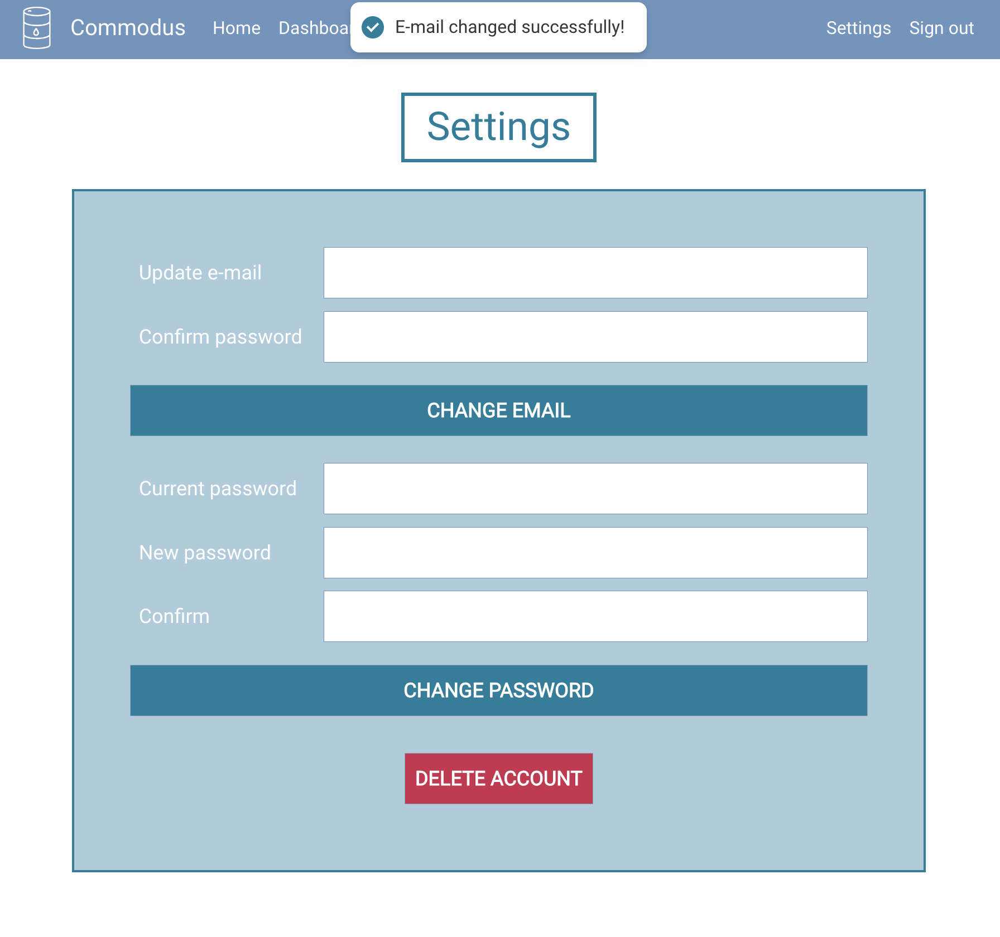

# Commodus
## Description
This was the final project completed as part of the General Assembly SEI Bootcamp. The goal of the project was to create a single-page web app using React as the front-end framework. NodeJS / Express were to be used for the back-end, with a MongoDB database. I have historically been interested in all things economics and finance, and recently finishing the immensely informative [The World for Sale](https://www.goodreads.com/book/show/52199304-the-world-for-sale) motivated me to centre my final project around the commodities market. Leaning heavily on my background in statistics, the idea formed to create an app that provides automated exploratory data analyses and visualisation of commodity prices.

## Deployment link
The project is hosted [here](https://commodus-0019e73e3c2a.herokuapp.com/).

## Code Installation & Setup Guide
1. **Clone the Repository**  
   ```bash
   git clone https://github.com/andy-ag/Commodus.git
   cd Commodus
   ```

2. **Set Up Node.js and MongoDB**  
   Ensure you have Node.js, npm, and MongoDB installed on your machine. If not, download and install them.

3. **Install Node.js Dependencies**  
   ```bash
   npm install
   ```

4. **Set Up Python for Analysis Scripts**  
   If you have Python installed, ensure you also have `pip` to install the necessary Python packages.
   ```bash
   python -m venv env
   source env/bin/activate  # On Linux/Mac
   env\Scripts\activate     # On Windows
   pip install -r requirements.txt
   ```

5. **Configure Environment Variables**  
   In the root directory of the project, create a `.env` file. Ensure it's filled with the following values (no string encasing):
   ```plaintext
   DATABASE_URL=your_mongodb_connection_string
   NASDAQ_API=your_nasdaq_api_key
   SECRET=your_selected_secret
   ```

   A NASDAQ API key can be obtained for free by following the sign-up process [here](https://data.nasdaq.com/sign-up).

6. **Start the Node.js Server**  
   ```bash
   node server
   ```

7. **Run the MERN App in Development Mode**  
   ```bash
   npm start
   ```
   By default, the React app will run on `http://localhost:3000` and the Node.js server on `http://localhost:3001`.

8. **Access the App in Your Browser**  
   Open a browser and navigate to:
   ```plaintext
   http://localhost:3000
   ```

9. **Enjoy!**  
   Explore the app and its features. If you encounter any issues, report them on the GitHub repository.

## Timeframe & Working Team
This was a project that I worked on independently, completed within c. 2 weeks.

## Technologies Used
This project used React as the front-end framework, with Bootstrap used for the bulk of the styling. Node and Express were used for the back-end, with MongoDB as the database. Python scripts were used for the data analysis and visualisation, run as child processes within Node. The Python packages I used were pandas, NumPy, scikit-learn and statsmodels, while PlotlyJS was used to plot the data on the front-end.

I used Figma to create the wireframes, and dbdiagram.io for the ERD. Trello was used as the organisation and task-prioritisation tool, and I used Postman extensively to test and debug my usage of the third-party API, as well as my local endpoints.

## Brief
The technical requirements for the project can be found below. There were no restrictions on the subject and scope of the app.

The project **must**:
  - Be a working full-stack, single-page application hosted on Heroku
  - Incorporate the technologies of the MERN-stack:
    - MongoDB/Mongoose
    - Express
    - React
    - Node
  - Have a well-styled interactive front-end
  - Communicate with the Express backend via AJAX
  - Implement token-based authentication
  - Implement authorization by restricting CRUD data functionality to authenticated users
  - Have a well-scoped feature set, with one of consumption of data from a third-party API, a highly dynamic UI, and data visualisation recommended

## Planning
My interest in the very broadly-defined financial sector made me want to undertake a project within this realm. Recently completing the excellent book [The World for Sale](https://www.goodreads.com/book/show/52199304-the-world-for-sale) made me want to narrow this down to commodity trading. The industry has always been quite informationally opaque, both in terms of publicly available data and broadcasted analysis techniques. I thought it would be an interesting project to try to address this information asymmetry, even if very slightly. This led to the idea of leveraging my academic background in economics and statistics to create an app for the automated exploratory data analysis of commodity prices. Additionally, I intentionally designed the user experience to be accommodating towards people with little to no experience with data analysis, while also not burdening users who do possess such experience. As an aside, the chosen name for this project - Commodus - is the Latin word that ‘commodity’ is derived from, meaning ‘useful’, ‘convenient’ - just what you want from a web app!

After thinking of the underlying idea, I came up with a core list of features that a user would expect to see when using the app. I settled on a landing page that would have a table with all of the available current commodity prices (I quickly found a free API that would provide the necessary information). Clicking the names in the table would take the user to a commodity detail page, where they would see an interactive carousel of analyses and plots for the chosen commodity. The user would also be able to create a personal dashboard, saving their favourite commodities for easy access.

After deciding on the appropriate feature set, I produced wireframes and an ERD. The app ended up matching the wireframe almost identically, and the ERD only needed minor tweaks to accommodate the specific implementation of the desired functionality that I ended up with.

Landing page:

 

Commodity detail:

 

Dashboard:

 


## Build process
The first order of business was setting up a skeleton for the back-end, with user authentication using JSON Web Tokens.

controllers/api/users.js
```javascript
const User = require('../../models/user.js')
const jwt = require('jsonwebtoken')
const bcrypt = require('bcrypt')

async function create(req, res){
    try {
        const user = await User.create(req.body)
        const token = createJWT(user)
        return res.json(token)
    } catch (error) {
        console.log(error)
        return res.status(401).json(error)
    }
}

async function login(req, res){
    try {
        const user = await User.findOne({email: req.body.email})
        const match = await bcrypt.compare(req.body.password, user.password);
        if (user && match) {   
            const token = createJWT(user)
            return res.json(token)
        } else {
            throw new Error()
        }
    } catch (error) {
        return res.status(400).json("Bad credentials")
    }
}

function createJWT(user){
    return jwt.sign(
        {user},
        process.env.SECRET,
        {expiresIn: '7d'}
        )
}
```

src/utilities/users-service.js
```javascript
import * as usersAPI from './users-api';

export async function signUp(userData) {
  try {
    const token = await usersAPI.signUp(userData);
    localStorage.setItem('token', token)
    return getUser()
  } catch (error) {
    console.log(error)
  }  
}
  
export function getToken() {
  const token = localStorage.getItem('token');
  if (!token) return null;
  const payload = JSON.parse(atob(token.split('.')[1]));
  // A JWT's exp is expressed in seconds, not milliseconds, so convert
  if (payload.exp < Date.now() / 1000) {
    localStorage.removeItem('token');
    return null;
  }
  return token;
}

export function getUser() {
  const token = getToken();
  return token ? JSON.parse(atob(token.split('.')[1])).user : null;
}

export function logOut() {
  localStorage.removeItem('token');
}

export async function login(credentials){
  try {
    const token = await usersAPI.login(credentials);
    localStorage.setItem('token', token)
    return getUser()
  } catch (error) {
    console.log(error.message)
    return { error: error.message } 
  }  
}

export async function checkToken() {
  try {
    const dateStr = await usersAPI.checkToken();
    return new Date(dateStr);
  } catch (error) {
    console.log(error.message)
    return { error: error.message } 
  }
  
}
```

src/utilities/users-api.js
```javascript
import sendRequest from './send-request';
const BASE_URL = '/api/users';
const LOGIN = '/login'
const CHECK_TOKEN = '/check-token'

export function signUp(userData) {
  return sendRequest(BASE_URL, 'POST', userData);
}

export function login(credentials) {
  return sendRequest(`${BASE_URL}${LOGIN}`, 'POST', credentials);
}

export function checkToken() {
  return sendRequest(`${BASE_URL}${CHECK_TOKEN}`);
}
```

The infrastructure skeleton was created in a separate repository, and saved for future use - the skeleton is context-agnostic and is a solid starting point for any future MERN-stack app that I will develop. I cloned this skeleton repo after it was complete.

The next task I tackled was the front-end skeleton. Guided by the wireframe, I knew what my navbar and footer should look like, and created those. Having the core components of the UI ready makes it much easier to assess how further components will look on a page, making it an important task to complete up-front when working in a full-stack context.

After this was complete, I turned to setting up the API that would be the source of data for my application. The planning stage had led me to the NASDAQ API, which intuitively seemed like a good choice owing to the strong brand name. Immediately, I was confronted with evidence to the contrary. The list of API parameters needed to retrieve the commodity data was not available in a clean format, but was instead housed in several separate tables within a webpage, prompting me to write a scraper to extract them using [Puppeteer](https://www.npmjs.com/package/puppeteer).

src/utilities/scraper.js
```javascript
// Scrape variable names & codes from NASDAQ API variable list page
const puppeteer = require('puppeteer');

async function scrapeTables(url) {
    const browser = await puppeteer.launch();
    const page = await browser.newPage();

    await page.goto(url, { waitUntil: 'networkidle0' });

    // Get the number of tables
    const numberOfTables = await page.$$eval('table', tables => tables.length);
    console.log(`Number of tables found: ${numberOfTables}`);

    const result = await page.evaluate(() => {
        const tables = document.querySelectorAll('table');
        const data = {};

        // Loop through each table starting from the second one
        for (let i = 1; i < tables.length; i++) {
            const table = tables[i];
            const rows = table.querySelectorAll('tbody > tr');

            // Loop through each row
            for (let j = 0; j < rows.length; j++) {
                const cells = rows[j].querySelectorAll('td');
                
                // Make sure the row has at least 3 cells
                if (cells.length > 2) {
                    // Get the text content of the first and third cells
                    const key = cells[0].textContent.trim().toString();
                    const value = cells[2].textContent.trim().toString();
                    
                    // Add the key and value to the data object
                    data[key] = value;
                }
            }
        }

        return data;
    });

    await browser.close();

    return result;
}

// Export the scrapeTables function
module.exports = {
    scrapeTables
};

// Example usage:
const url = 'https://blog.data.nasdaq.com/api-for-commodity-data';
scrapeTables(url).then((data) => {
    console.log(data);
}).catch((error) => {
    console.error('An error occurred:', error);
});
```

After I had the parameters in a friendly format, I began to explore the structure of the API responses. I immediately discovered another issue - from the initial list of c. 160 commodities, around half had non-functional codes to be used as the API call parameters. Of the half that were active, a large amount had data with the last entry being years in the past, and as such also unsuitable for the project. Ultimately I ended up with a list of 46 commodities, with a disappointing three having daily data, and the rest only having monthly updates.

While this wasn’t ideal, a large part of exploratory data analysis for time series comprises examining longer term trends, so monthly data does the trick in that regard. Furthermore, I was using a free API for this project, so some issues were probably to be expected in any case.

After I had familiarised myself with the format of the requests and responses, I began writing the Python analysis script. I had done some research on how to run it within a Node environment, and settled on running it as a [child process](https://nodejs.org/api/child_process.html). One feasible alternative was setting up the analysis script as a separately hosted microservice, but that would involve the fixed time cost of setting up its own backend infrastructure, regardless of the small scale of the service. Furthermore, making several calls to different services could also have a non-negligible impact on the speed of the app, given that I would not be using high-speed hosting, and I decided that having all the functionality in one place would be the best approach on this occasion.

src/utilities/analysis.py
```python
import pandas as pd
import numpy as np
import json
import sys
from statsmodels.tsa.stattools import acf, pacf, adfuller

# Read input data from standard input
data = json.load(sys.stdin)

# Extract info
frequency = data['frequency']
column_names = data['colNames']
data_rows = data['timeSeries']

# Convert to DataFrame
df = pd.DataFrame(data_rows, columns=column_names)
df["Date"] = pd.to_datetime(df["Date"])

# If more than two columns, select the first one that contains 'USD'
if len(df.columns) > 2:
    value_cols = [col for col in df.columns if 'USD' in col]
    if value_cols:
        df['Value'] = df[value_cols[0]]
    else:
        print('No column with "USD" found. Using the second column as "Value".')
        df['Value'] = df.iloc[:, 1]

# Handle nulls, coerce to numeric as a safety measure
df['Value'] = pd.to_numeric(df['Value'], errors='coerce')
df['Value'] = df['Value'].fillna(method='ffill')
df['Value'] = df['Value'].fillna(method='bfill')
df['Value'] = df['Value'].fillna(0)

df = df[["Date", "Value"]].set_index("Date").sort_index()

# Compute MA smoothed time series
df['MA_Smoothed'] = df['Value'].rolling(window=3).mean()

# Compute ACF and PACF
nobs = len(df["Value"])
# Package calculates lag ceiling using nobs // 2, for strict inequality -1 is always needed
# Going above 16 lags isnt particularly informative
lags = min((nobs // 2) - 1, 16)   
acf_values = acf(df["Value"], nlags=lags)
pacf_values = pacf(df["Value"], nlags=lags)

# Compute statistics
mean = df['Value'].mean()
std_dev = df['Value'].std()
variance = df['Value'].var()
adf_result = adfuller(df['Value'])
statistics = {
    "Mean": mean,
    "Standard deviation": std_dev,
    "Variance": variance,
    "ADF test statistic": adf_result[0],
    "p-value": adf_result[1]
}

# Compute delay plot values
# Compute Delay plots
delay_plots = {}
for tau in range(1, 13): # tau values from 1 to 12
    delay_plots[str(tau)] = {
        "x": df['Value'].iloc[:-tau].tolist(), # x(t-tau)
        "y": df['Value'].iloc[tau:].tolist()  # x(t)
    }


#Fill NaN values for JSON compatibility
df['Value'].fillna(0, inplace=True)

# Prepare output data
output_data = {
    "raw_time_series": {
        "dates": df.index.strftime('%Y-%m-%d').tolist(),
        "values": df["Value"].tolist()
    },
    "acf_plot": {
        "lags": list(range(len(acf_values))),
        "acf_values": acf_values.tolist()
    },
    "pacf_plot": {
        "lags": list(range(len(pacf_values))),
        "pacf_values": pacf_values.tolist()
    },
    "ma_smoothed": {
        "dates": df[df['MA_Smoothed'].notna()].index.strftime('%Y-%m-%d').tolist(),
        "values": df[df['MA_Smoothed'].notna()]["MA_Smoothed"].tolist()
    },
    "delay_plots": delay_plots,
    "statistics": statistics,
    "frequency": frequency,
}

# Write output data
json.dump(output_data, sys.stdout)
```

After the script was ready, I implemented the controller that would run it as a child process when called, thus finishing the core back-end functionality of the app. The script took some time to run, and I decided to implement a cache-like alternative path, whereby the results of the analysis would be stored as a JSON object in my database. If the database entry was less than a day old, the analysis would be retrieved from there, otherwise the script would run and the database would be updated. This alternative path ended up saving some time, making for a smoother user experience.

controllers/api/commodities.js
```javascript
async function analyse(req, res){
    const commodityCode = decodeURIComponent(req.params.params)
    let commodity = await Commodity.findOne({apiParams: commodityCode});
    if (!commodity || !commodity.analysisResult || Date.now() - new Date(commodity.updatedAt).getTime() > 24 * 60 * 60 * 1000) {
        console.log('API path')
        const timeSeriesData = await getTimeSeries(commodityCode);
        
        // Different Python spawn syntax for local & Heroku
        // const python = spawn('/opt/homebrew/bin/python3', [pythonScriptPath]);
        const python = spawn('python', [pythonScriptPath]);

        python.stdin.write(JSON.stringify(timeSeriesData));
        python.stdin.end(); 
        let outputData = '';
        let errorOccurred = false;

        python.stdout.on('data', (data) => {
            outputData += data.toString();
        });

        python.stderr.on('data', (data) => {
            console.error(`Python script error output: ${data}`);
        });

        python.on('error', (error) => {
            console.error(`Error occurred in Python child process: ${error.message}`);
            res.status(500).json({error: 'An error occurred in the Python child process'});
            errorOccurred = true;
        });

        python.stdout.on('error', (error) => {
            console.error(`An error occurred while reading from stdout: ${error.message}`);
        });
        
        python.stderr.on('error', (error) => {
            console.error(`An error occurred while reading from stderr: ${error.message}`);
        });

        python.on('close', async (code) => {
            if (!errorOccurred) {
                try {
                    outputData = JSON.parse(outputData);
                    if (commodity) {
                        commodity.analysisResult = outputData;
                        await commodity.save();
                    } else {
                        // if commodity doesn't exist, create a new one
                        await Commodity.create({
                            apiParams: commodityCode,
                            name: timeSeriesData.name,
                            frequency: timeSeriesData.frequency,
                            colNames: timeSeriesData.colNames,
                            endDate: timeSeriesData.endDate,
                            timeSeries: timeSeriesData.timeSeries,
                        });
                    }
                    res.json(outputData);
                } catch (error) {
                    console.error(`Error parsing Python child process output: ${error.message}`);
                    res.status(500).json({error: 'An error occurred while parsing the Python child process output'});
                }
        }});
    } else {
        console.log('DB path')
        res.json(commodity.analysisResult);
    }
}
```

The next step was implementing the interactive plot carousel. I used the JavaScript Plotly package for the plot, and nested it within my Carousel component, which handled all the switching logic. I wanted the user to be able to navigate the plots by using the arrows or the dropdowns, and thus had to implement logic for tracking the currently chosen plot.

I also wanted to give users the ability to interact with the data themselves, in adherence to the vision of this project. To this end, I added a download button that would allow a user to download the data used to create the currently visible plot as either JSON or CSV. Setting the download data was also handled within the Carousel component.

src/components/Carousel.jsx
```javascript
import { useState, cloneElement, useCallback } from 'react';
import { FontAwesomeIcon } from '@fortawesome/react-fontawesome';
import { faDownload } from '@fortawesome/free-solid-svg-icons';
import './Carousel.css'
import InfoBox from './InfoBox';
import { saveAs } from 'file-saver';
import Papa from 'papaparse';

export default function Carousel({children, params, frequency}) {
  const PLOT_ORDER = ["raw", "ma", "acf", "pacf", "delay"]
  const INFO_KEYS = ["Time series", "Moving average", "Autocorrelation function", "Partial autocorrelation function", "Delay plot"]
  const [currentIndex, setCurrentIndex] = useState(0);
  const [selectedTimeSeries, setSelectedTimeSeries] = useState(`${params}-raw`);
  const [selectedTimePeriod, setSelectedTimePeriod] = useState('all');
  const [downloadData, setDownloadData] = useState([]);
  const [selectedTau, setSelectedTau] = useState('1');
  const selectedAnalysis = INFO_KEYS[currentIndex];

  function isTimePeriodDisabled(selectedTimeSeries) {
    return selectedTimeSeries.includes('acf') || selectedTimeSeries.includes('pacf');
  }
  
  const handleSetDownloadData = useCallback(({ index, dataForDownload, plotId, timePeriod }) => {
    setDownloadData(prev => {
      const newData = [...prev];
      newData[index] = { dataForDownload, plotId, timePeriod };
      return newData;
    });
}, []);


  function handleDownload(format) {
    const { dataForDownload, plotId, timePeriod } = downloadData[currentIndex];
    if (format === 'json') {
        const blob = new Blob([JSON.stringify(dataForDownload)], {type: "text/plain;charset=utf-8"});
        saveAs(blob, `${plotId}_${timePeriod}.json`);
    } else if (format === 'csv') {
        const csv = Papa.unparse(dataForDownload);
        const blob = new Blob([csv], {type: "text/csv;charset=utf-8"});
        saveAs(blob, `${plotId}_${timePeriod}.csv`);
    }
  }


  function goToPrevPlot() {
    setCurrentIndex(oldIndex => {
        let newIndex = oldIndex === 0 ? children.length - 1 : oldIndex - 1;
        setSelectedTimeSeries(`${params}-${PLOT_ORDER[newIndex]}`);
        return newIndex;
    });
  }

  function goToNextPlot() {
    setCurrentIndex(oldIndex => {
        let newIndex = (oldIndex + 1) % children.length;
        setSelectedTimeSeries(`${params}-${PLOT_ORDER[newIndex]}`);
        return newIndex;
    })
  }

  return (
      <>
        <div className="d-flex justify-content-center mt-4 gap-2">
          <select className="form-select tau" value={selectedTau} onChange={e => setSelectedTau(e.target.value)} style={{display: selectedTimeSeries === `${params}-delay` ? 'block' : 'none'}}>
              {Array.from({length: 12}, (_, i) => i + 1).map(tau =>
                  <option value={tau} key={tau}>t = {tau}</option>
              )}
          </select>
          <InfoBox selectedAnalysis={selectedAnalysis} />
          <select className="form-select" value={selectedTimeSeries} onChange={e => {
              const newTimeSeries = e.target.value;
              setSelectedTimeSeries(newTimeSeries);
              setCurrentIndex(PLOT_ORDER.indexOf(newTimeSeries.split('-')[1]))
              if (isTimePeriodDisabled(newTimeSeries)) {
                setSelectedTimePeriod('all');
              };
          }}>
              <option value={`${params}-raw`}>raw time series</option>
              <option value={`${params}-ma`}>moving average</option>
              <option value={`${params}-acf`}>acf</option>
              <option value={`${params}-pacf`}>pacf</option>
              <option value={`${params}-delay`}>delay plot</option>
          </select>
          <select className="form-select" value={selectedTimePeriod} disabled={isTimePeriodDisabled(selectedTimeSeries)} onChange={e => {
              setSelectedTimePeriod(e.target.value)
          }}>
              {frequency === 'daily' &&<option value="week">past week</option>}
              {frequency === 'daily' &&<option value="month">past month</option>}
              <option value="year">past year</option>
              <option value="all">all time</option>
          </select>
          <div className="dropdown">
            <button className="btn btn-icon" title="Download raw data" type="button" id="downloadMenuButton" data-bs-toggle="dropdown" aria-expanded="false">
            <FontAwesomeIcon icon={faDownload} style={{color: 'var(--accent)'}} title="Download data" />
            </button>
            <ul className="dropdown-menu" aria-labelledby="downloadMenuButton">
              <li><button className="dropdown-item" onClick={() => handleDownload('json')}>JSON</button></li>
              <li><button className="dropdown-item" onClick={() => handleDownload('csv')}>CSV</button></li>
            </ul>
          </div>
      </div>
      
      
      <div className="carousel-container">
        <button className="triangle triangle-left" onClick={goToPrevPlot}></button>
        <div className="carousel-plot">{cloneElement(children[currentIndex], { 
          timePeriod: selectedTimePeriod,
          setDownloadData: handleSetDownloadData,
          index: currentIndex,
          frequency: frequency,
          selectedTau: selectedTau
      })}</div> 
        <button className="triangle triangle-right" onClick={goToNextPlot}></button>
      </div>
    </>
  );
}
```

The data was passed down to the carousel and the plots from the CommodityPage component, where the internal API calls were made to run the analysis on the data. As part of a smooth user experience, I added toasts (small pop-ups at the top of the screen) to be displayed during / after any data operation, to let the user know that everything is working as intended, and to wait instead of refreshing the page, or even worse, closing it.

src/components/pages/CommodityPage/CommodityPage.jsx
```javascript
import './CommodityPage.css';
import { useEffect, useState, useRef } from 'react'
import { useParams } from 'react-router-dom'
import Plot from '../../components/Plot.jsx'
import HeaderBox from '../../components/HeaderBox.jsx'
import Carousel from '../../components/Carousel.jsx'
import CommodityTable from '../../components/CommodityTable.jsx';
import { toast } from 'react-hot-toast';
const varNames = require('../../utilities/scrapedNames') 


export default function CommodityPage({ params: externalParams = null, data: externalData = null, checkFav = true, index, removeFromFavourites, loading=false, onCommodityLoaded, isStandalone=true }) {
    // If commodity code passed down, use that, else get from query params
    const { params: routeParams } = useParams();
    const params = externalParams || routeParams;

    const variable = Object.keys(varNames).find(key => varNames[key] === params)
    const token = localStorage.getItem('token')
    const [data, setData] = useState(externalData);
    const [isFav, setFav] = useState(false);
    const toastIdRef = useRef(null);

    useEffect(() => {
        if (data !== null && loading) {
            onCommodityLoaded();
        }
    }, [data, loading, onCommodityLoaded]);

    useEffect(() => {
        if (isStandalone) {
            toastIdRef.current = toast.loading('Crunching the numbers', {
                iconTheme: {
                  primary: 'var(--accent)',
                  secondary: 'white',
                },
            });
        }
    }, [isStandalone]);

    useEffect(() => {
        if (checkFav) {
        const checkFav = async () => {
            try {
                const response = await fetch(`/api/commodities/${encodeURIComponent(params)}/isfavourite`, {
                    method: 'GET',
                    headers: {
                        'Content-Type': 'application/json',
                        'Authorization': 'Bearer ' + token,
                    },
                });
                if (!response.ok) throw new Error(`HTTP error! status: ${response.status}`);
                const favStatus = await response.json();
                setFav(favStatus === 'true');
            } catch (error) {
                console.error(`Error checking favourite status: ${error.message}`);
            }
        };
        checkFav();
    }}, [params, token, checkFav]);

    useEffect(() => {
        const fetchCommodityAnalysis = async () => {
            try {
                const response = await fetch(`/api/commodities/${encodeURIComponent(params)}`);
                const data = await response.json();
                setData(data);
                if (isStandalone) {
                    toast.dismiss(toastIdRef.current);
                }
            } catch (error) {
                console.error(`An error occurred while fetching the commodity analysis:`, error);
            }
        };

        const delay = 100*index
        setTimeout(fetchCommodityAnalysis, delay)
    }, [params, index, isStandalone]);

    if (data === null) {
        return null;
    }
    
    return(
        <>
            <div className="grid-container">
                <div className="header-wrapper">
                    <HeaderBox text={variable} add={true} fav={isStandalone ? isFav : false} apiParams={params} removeFromFavourites={removeFromFavourites} isStandalone={isStandalone}/>
                </div>
                <p className="frequency">({data.frequency} data)</p>
                <Carousel params={params} frequency={data.frequency}>
                    <Plot data={data.raw_time_series} plotId={`${params}-rawPlot`} frequency={data.frequency}/>   
                    <Plot data={data.ma_smoothed} plotId={`${params}-maPlot`} frequency={data.frequency}/>   
                    <Plot data={data.acf_plot} plotId={`${params}-acfPlot`} frequency={data.frequency}/>   
                    <Plot data={data.pacf_plot} plotId={`${params}-pacfPlot`} frequency={data.frequency}/>   
                    <Plot data={data.delay_plots} plotId={`${params}-delayPlot`} frequency={data.frequency}/>   
                </Carousel>
                <CommodityTable statistics={data.statistics} rawTimeSeries={data.raw_time_series}/>
            </div>
        </>
    ) 
}
```

The final additions to the UI for the commodity analysis page were the buttons to add a commodity to a user’s favourites list, and an info popup which gives the user a basic summary of the method of analysis being used, and has a link to the relevant Wikipedia page if a more detailed account is required. These were implemented in the HeaderBox and InfoBox components, reused throughout the project as necessary. The HeaderBox handles the logic of checking whether a commodity is in a user’s favourites array, and thus decides whether to display a ‘+’ or a ‘-’ icon.

src/components/HeaderBox.jsx
```javascript
import { FontAwesomeIcon } from '@fortawesome/react-fontawesome'
import { faSquarePlus, faSquareMinus } from '@fortawesome/free-solid-svg-icons'
import './HeaderBox.css'
import InfoBox from './InfoBox'
import { useState } from 'react'
import { toast } from 'react-hot-toast'

export default function HeaderBox({ text, add, fav, apiParams, removeFromFavourites=null, isStandalone, info=false}) {
    const [isFav, setFav] = useState(fav)
    const token = localStorage.getItem('token')
    async function handleFav() {
        try {
            const response = await fetch(`/api/commodities/${encodeURIComponent(apiParams)}/favourite`, {
                method: 'POST',
                headers: {
                    'Content-Type': 'application/json',
                    'Authorization': 'Bearer ' + token,
                },
                body: JSON.stringify({apiParams: apiParams})
            });
            if (!response.ok) throw new Error(`HTTP error! status: ${response.status}`);
            const res = await response.json();
            // Update the state based on the server response
            if (res === 'added') {
                setFav(true);
                toast.success('Added to dashboard', {
                    iconTheme: {
                      primary: 'var(--accent)',
                      secondary: 'white',
                    },
                  });
            } else if (res === 'removed') {
                setFav(false);
                toast.error('Removed from dashboard', {
                    iconTheme: {
                        primary: '#CE2D4F',
                        secondary: 'white',
                    },
                });
                if (removeFromFavourites) removeFromFavourites(apiParams)
            }
        } catch (error) {
            console.error(`Error adding commodity to dashboard: ${error.message}`);
            toast.error('You must be logged in to add a commodity to your dashboard', {
                iconTheme: {
                    primary: '#CE2D4F',
                    secondary: 'white',
                },
            });
        }
    }
    
    return(
        <div className="header-box d-flex justify-content-between align-items-center mt-3">
            <h1>{text}</h1>
            {add && (
                isStandalone ? (isFav ? <FontAwesomeIcon className="toggleSaveCommodity" icon={faSquareMinus} onClick={handleFav}/> : <FontAwesomeIcon className="toggleSaveCommodity" icon={faSquarePlus} onClick={handleFav}/>) : <FontAwesomeIcon className="toggleSaveCommodity" icon={faSquareMinus} onClick={handleFav}/>
            )}
            {info && <div className="info-box-container"><InfoBox selectedAnalysis={text} /></div>}
        </div>
    )
}
```

src/components/InfoBox.jsx
```javascript
import { useState } from 'react';
import './InfoBox.css';
const infoMap = require('../utilities/techniques');

export default function InfoBox({ selectedAnalysis }) {
  const [show, setShow] = useState(false);

  const handleClose = () => setShow(false);
  const handleShow = () => setShow(true);

  const analysisInfo = infoMap[selectedAnalysis];
  const description = analysisInfo ? analysisInfo.description : 'No description available';

  return (
    <>
      <button className="btn btn-link info-box" onClick={handleShow}>
        <i className="fas fa-info-circle"></i>
      </button>

      <div className={`modal ${show ? 'show' : ''}`} tabIndex="-1" style={{display: show ? 'block' : 'none'}}>
        <div className="modal-dialog modal-dialog-centered">
          <div className="modal-content border-info">
            <div className="modal-header border-0 justify-content-center">
              <h5 className="modal-title">{selectedAnalysis}</h5>
              <button type="button" className="btn-close position-absolute close-modal-btn" onClick={handleClose}></button>
            </div>
            <div className="modal-body text-start">
                <p dangerouslySetInnerHTML={{ __html: description }}></p>
            </div>
            <div className="modal-footer justify-content-center border-0">
              <button type="button" className="btn btn-secondary close-modal" onClick={handleClose}>
                Close
              </button>
            </div>
          </div>
        </div>
      </div>
    </>
  );
}
```

A set of screenshots displaying the aforementioned elements of the commodity analysis page can be found below.

Page load - Python analysis script is being run

 

Page loaded

 

Download icon clicked

 

Different plot selected from drop-down

 

Info icon clicked, InfoBox modal displayed

 

Add to / remove from dashboard UI

 

 

 

 


Stats table below plot

 

After the analysis page was complete, I created the Dashboard, which is essentially a scrollable list of CommodityPage components, displaying the same information as the analysis page, but for all of the user’s added commodities in one place. 

The final major outstanding feature was a stretch goal initially, but I had enough time to implement it in a way that would add value to the app. It was the Compare page, where a user can plot two commodities on one graph, and access additional comparative statistical analyses that can only be performed on multiple time series, rather than one.

I wrote a separate script and controller function for the comparison, but since they are similar in structure to the initial analysis script that was already shown, there is little need to display them here. Similarly, the plot component behaved similarly to the one time-series case, with some adjustments to the Plotly parameters that would allow two time-series to be plotted.

Screenshots showcasing the functionality of the Compare page can be found below.

Page loaded

 

Info icon clicked - InfoBox modal displayed

 

Commodities selected

 

‘Analyse’ button clicked

 

Results of analysis displayed

 

Example InfoBox - Engle-Granger cointegration test

 

Having completed the Compare page, all the core functionality of the app was done. The outstanding tasks were quality-of-life improvements. I added the FAQ, Privacy Policy, Terms of Service and Contact pages to inform the users of what the app sets out to do, and how their personal data is treated.

I then proceeded to add some expected account manipulation functionality in the Settings page - changing email address, changing password, and deleting one’s account. This required adding a few controller functions and setting up the UI.

controllers/api/users.js
```javascript
async function changeEmail(req, res){
    try {
        const user = await User.findById(req.user._id)
        const match = await bcrypt.compare(req.body.password, user.password);
        if (!match) throw new Error()

        user.email = req.body.email
        await user.save()

        return res.json(user)
    } catch (error) {
        return res.status(400).json("Error changing email")
    }
}

async function changePassword(req, res){
    try {
        const user = await User.findById(req.user._id)
        const match = await bcrypt.compare(req.body.password, user.password);
        if (!match) throw new Error()

        user.password = req.body.newPassword
        await user.save()

        return res.json(user)
    } catch (error) {
        return res.status(400).json("Error changing password")
    }
}

async function deleteAccount(req, res){
    try {
        const user = await User.findByIdAndDelete(req.user._id)
        return res.json(user)
    } catch (error) {
        return res.status(400).json("Error deleting account")
    }
}
```

Settings page

 

Account deletion confirmation modal

 

Example - email change

 

 

The final (and pleasantly simple) step was to deploy the project to Heroku. The only app-specific action that I had to take was setting up a requirements.txt file with my Python dependencies in the project’s root folder, and adding a Python module to the Heroku project, so it knew to set up the virtual environment with these packages installed.

requirements.txt
```plaintext
numpy==1.24.3
pandas==2.0.2
scikit-learn==1.3.0
statsmodels==0.14.0
```

## Challenges
Balancing work on the front-end against adding new features was one strategic challenge that I faced. I am a back-end engineer at heart, and get much more excited about implementing the logic responsible for the operation of a system. Working on front-end components is rewarding in its own way, but I always tend to gravitate towards function over form, if given a choice. Furthermore, getting CSS to match one’s lofty design ambitions can often be a struggle, and to me was the source of much frustration, at times.

However, I know full well that an elegant and thoughtfully designed UI is a crucial component for a seamless user experience. Thus, I made an active effort to overcome my instincts, and work on polishing many of the front-end components rather than adding more functionality. A good example of this was the addition of toasts (small pop-up messages at the top of the screen) that guide the user and inform them of what the app is currently doing. If I had overlooked this aspect, a user may have found themselves refreshing the page when an analysis script was taking its time, rather than waiting that tiny bit longer. Such an experience would probably cause them to discard the website as non-functional, or unpleasant to use at the very least - not what we want at all!

Another challenge was implementing the Python scripts - the engine of my app’s core functionality. I faced a conceptual challenge in being able to conduct the analysis that I wanted, in that we had to use NodeJS (and hence JavaScript) for the server-side logic, but JS does not have the statistical analysis libraries that I needed, and writing them from scratch was not an option.

I knew that there must surely exist a way to run a Python script within Node, and after some independent research discovered that indeed there was - child processes. I ended up successfully overcoming this challenge, and implementing the solution seamlessly, showcasing the ability to go off and solve non-trivial problems without outside assistance. 

## Wins
A key win for me on this project was the fact that I managed to create a polished, working single-page app that actually offers a unique service by conducting an extensive statistical exploration of commodity price data, all within a fairly tight deadline. I showed the ability to effectively plan and scope the feature set, and then implement this plan, executing both the design strategy and the back-end logic as conceptualised initially, without any compromises.

I managed to refresh and immediately put to use my knowledge of data manipulation and analysis packages in Python by using pandas, NumPy, scikit-learn and statsmodels to conduct a deep dive into commodity prices, and pass this to a front-end JS visualisation framework in Plotly.

Another technical win was my ability to tackle several previously unseen conceptual problems and effectively solve them. One of these was executing a Python script within NodeJS, as detailed at the end of the previous section. The other was the setting up of client-side caching for the homepage to address its slow loading time.

## Key Learnings/Takeaways
One key takeaway from this project was, once again, the value of a good plan. Taking the time to sit down and think intentionally about the user stories, the feature set that they imply, the design choices that align with these, as well as the problems you may encounter, helps one avoid taking forced breaks from the build process down the line. A solid plan minimises the chances that you will find yourself uncertain as to the next steps, the order of priorities, a local design choice; instead, it guides you and makes you more confident to press on.
A key technical takeaway was the experience of building a React app. Now that I have gone through a full-stack project and familiarised myself with the mechanics and design principles of Hooks and reusable components, I am confident in taking on further work using this framework.

Finally, I am now more confident in my capability to take on large projects independently, and more comfortable in tackling unseen problems, learning to use new tools on the fly. I am excited to keep growing as a software engineer, and taking on ambitious projects in the future with faith in my abilities, and the resolve to execute them to the highest standard.

## Bugs
While not necessarily a bug in the strict sense, sometimes the rate limits of the free NASDAQ API can cause the requests to return errors. For instance, if a user aggressively refreshes and navigates to multiple pages that make API calls in quick succession, this could lead to the rate limit being breached and the app not to behave as expected.

Of course, if this was a commercial project, then a free API would not be used, and this problem would not exist in its current form. Different issues with scalability could arise and need addressing, but these fall firmly outside the scope of this project.

## Future Improvements
An immediately obvious improvement that can be made is finding better quality data to power the app. Initially, the NASDAQ API looked like it would provide the requisite quality, but after setting it up and parsing through the response data, it became apparent that the service was not quite as comprehensive as advertised. I decided to go forward without changing my information source, as the project in its current iteration is more of a proof-of-concept than a fully-finished product, and the available data was sufficient to that end. Clearly, the better the data that goes into the analysis script, the richer the outputs that we can get. Finding a data source that would provide this input quality would thus instantly boost the value of the app.

Another improvement that can be made is a greater volume of analysis. Although I have covered many of the core time-series exploration techniques, there are of course many more that I have not used. Some examples include frequency analysis, trend and seasonality decomposition, vector autoregressive models. In addition to including more techniques, the combinatorial coverage of existing ones can also be improved. For instance, currently the ACF and PACF plots are only available for the entire time-series of each commodity. It would be useful to run separate estimations of these for the past month and year, or even for a custom period chosen by the user, as structural changes in the price dynamics of a given commodity may have occurred at multiple points in time since the start of observation (it isn’t unreasonable to assume that the fall of the Soviet Union and the recent fracking boom in the US, for instance, were events that could have affected the fundamental structure of the oil and natural gas markets).

One large feature that could potentially warrant being added to the app is the ability of a user to generate a forecast of the prices of a given commodity, with a range of statistical and machine-learning models to choose from. Given my background in the respective fields, there was no knowledge barrier to this. Indeed, I initially considered adding basic ARIMA forecasting as a taster option. However, there were (and are) a few issues with this extension. The time budget to complete the project was fairly tight, but more importantly, forecasting does not align entirely with the vision for the app that had solidified as I was working on it. I see Commodus as a tool for exploratory data analysis specifically - analysis that is not prescriptive, and one that will guide the user and allow them to move to a deeper exploration themselves. Forecasting is a process that requires a much more particular dive into a large set of contextual factors, as well as many rounds of iterative tinkering and calibration. It thus lends itself much less to automation than the exploratory analysis that I implemented. Ultimately I decided that having (almost invariably) poor forecasts would be worse than having none at all, as it could give users an implicit promise of robustness, and then cause disappointment when the expectation was not fulfilled.

If this feature were to ultimately be added, it would require lots of time to get right, as well as a careful consideration of the goals of the app, and the associated user experience. But, if done correctly, it could definitely give the app an extra dimension of quality.

Finally, there are a few features that could enhance the user experience without changing the core functionality of the app. One such feature is the ability to generate automated reports in a range of formats, to be available for download or to be sent to a user’s email inbox. This would allow a user to save time and effort if their goal was to share the information available on the app with a third party. Another quality-of-life improvement would be a reformatting of the dashboard page to include movable commodity blocks with expandable / retractable information components. This would increase the ability of a user to customise their dashboard, and thus allow the app to be better aligned to a wider set of potential use-cases.